# 基于springboot的疫情打卡健康评测系统

---
### 👉作者QQ ：1556708905 微信：zheng0123Long (支持定制修改、部署调试、定制毕设)

### 👉接网站建设、小程序、H5、APP、各种系统等

---

#### 介绍

随着新冠疫情的全球蔓延，各国各地的学校和教育机构面临着前所未有的挑战。如何有效地管理学生的健康状况、确保校园的安全成为了亟待解决的问题。基于此背景，我开发了一套基于Spring Boot的疫情打卡健康评测系统，旨在通过信息化手段提升疫情期间的健康管理效率，确保师生的安全。
该系统拥有两种角色：管理员角色和用户角色。管理员角色主要负责系统的整体管理和维护，包括学生返校申请、打卡记录、留言板、资讯信息、居家管理、学生管理、试卷和考试管理等；用户角色则主要负责日常的健康打卡、返校申请、参与考试和查看资讯信息等。

#### 技术栈

后端技术栈：Springboot+Mysql+Maven

前端技术栈：Vue+Html+Css+Javascript+ElementUI

开发工具：Idea+Vscode+Navicate

#### 系统功能介绍

管理员角色功能模块  
个人中心：  
个人信息管理：管理员可以查看和修改个人信息，包括姓名、联系方式、密码等。  
消息通知：管理员可以接收系统通知和公告，了解系统更新和重要事项。  
基础数据管理：  
数据字典管理：维护系统中使用的基础数据，如学生信息、健康状态等。  
学生返校申请管理：  
申请审核：管理员可以查看和审核学生提交的返校申请，确保返校流程的规范性。  
申请记录管理：管理员可以查看和管理所有学生的返校申请记录，便于统计和查询。  
打卡管理：  
打卡记录查看：管理员可以查看所有学生的健康打卡记录，包括体温、健康状态等。  
异常情况处理：对于打卡记录中的异常情况，管理员可以及时处理和跟进。  
留言板管理：  
留言审核：管理员可以审核并管理学生在留言板上的留言，确保留言内容的规范性。  
回复留言：管理员可以回复学生的留言，解答学生的问题和疑虑。  
资讯信息管理：  
资讯发布：管理员可以发布最新的疫情资讯、校园通知等，确保信息的及时传达。  
资讯管理：管理员可以管理已发布的资讯信息，包括修改和删除。  
居家管理：  
居家记录管理：管理员可以查看和管理学生的居家记录，确保学生在居家期间的健康状况。  
居家健康监测：管理员可以对居家学生进行健康监测，确保学生的健康安全。  
学生管理：  
学生信息管理：管理员可以添加、修改和删除学生信息，分配学生账号和权限。  
健康状态管理：管理员可以查看和管理学生的健康状态，确保学生的健康安全。  
试卷管理：  
试卷创建：管理员可以创建新的试卷，包括试题的添加、修改和删除。  
试卷管理：管理员可以管理已创建的试卷，确保试卷的有效性和准确性。  
考试管理：  
考试安排：管理员可以安排考试，包括考试时间、地点和参与学生等信息。  
考试记录管理：管理员可以查看和管理学生的考试记录，便于统计和查询。  
轮播图信息：  
轮播图发布：管理员可以发布和管理系统首页的轮播图信息，提升系统的视觉效果和用户体验。  

用户角色功能模块  
个人中心：  
个人信息管理：用户可以查看和修改个人信息，包括姓名、联系方式、密码等。  
消息通知：用户可以接收系统通知和公告，了解系统更新和重要事项。  
试卷表：  
试卷查看：用户可以查看系统中发布的试卷，了解考试内容和要求。  
试卷作答：用户可以在线作答试卷，并提交答案进行评测。  
留言板：  
留言发布：用户可以在留言板上发布留言，提出问题和建议。  
留言查看：用户可以查看管理员和其他用户的留言，了解相关信息。  
资讯信息：  
资讯查看：用户可以查看系统发布的最新资讯信息，包括疫情动态、校园通知等。  
后台管理：  
学生返校申请管理：用户可以提交返校申请，填写相关信息并等待审核。  
打卡管理：用户可以进行每日健康打卡，记录体温和健康状态，并查看打卡记录。  
留言板管理：用户可以管理自己发布的留言，包括修改和删除。  
资讯信息管理：用户可以查看和管理自己发布的资讯信息。  
居家管理：用户可以记录和管理自己的居家状态，填写每日的健康状况。  
考试管理：用户可以查看考试安排，参与在线考试，并查看考试成绩。  

#### 系统作用

该疫情打卡健康评测系统通过信息化手段，有效提升了疫情期间的健康管理效率，确保了师生的安全。具体作用如下：  
提升管理效率：管理员可以通过系统方便地管理学生的健康打卡记录、返校申请、考试安排等，提高管理效率，减少人工操作的繁琐。  
优化用户体验：用户可以通过系统进行每日健康打卡、提交返校申请、参与在线考试等，提升了疫情期间的生活和学习便利性。  
数据准确性：通过系统的统一管理，确保了学生健康打卡记录、返校申请、考试记录等数据的准确性，减少了数据错误和重复。  
信息传达：系统的资讯信息管理和消息通知功能确保了管理员和用户能够及时了解最新的疫情动态和校园通知，提升了信息传达的效率。  
健康监测：系统的居家管理和健康打卡功能帮助管理员和用户实时监测学生的健康状况，及时发现和处理异常情况，确保学生的健康安全。  

#### 系统功能截图

代码结构

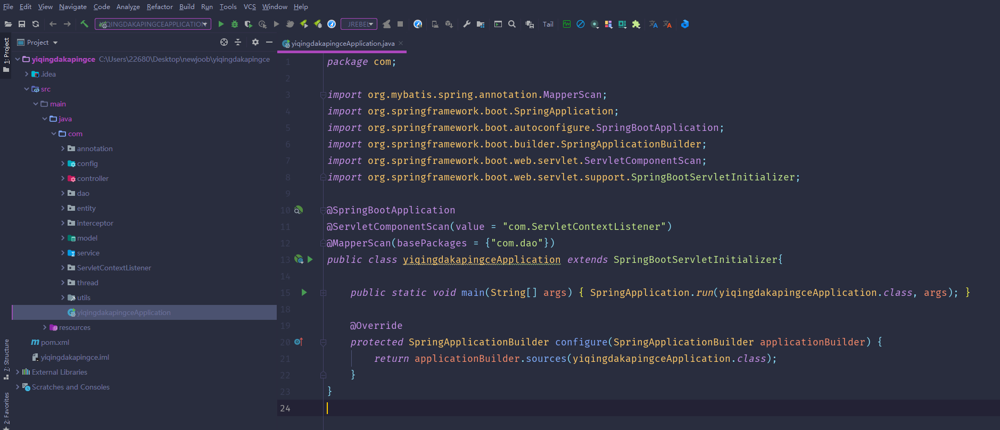

数据库表

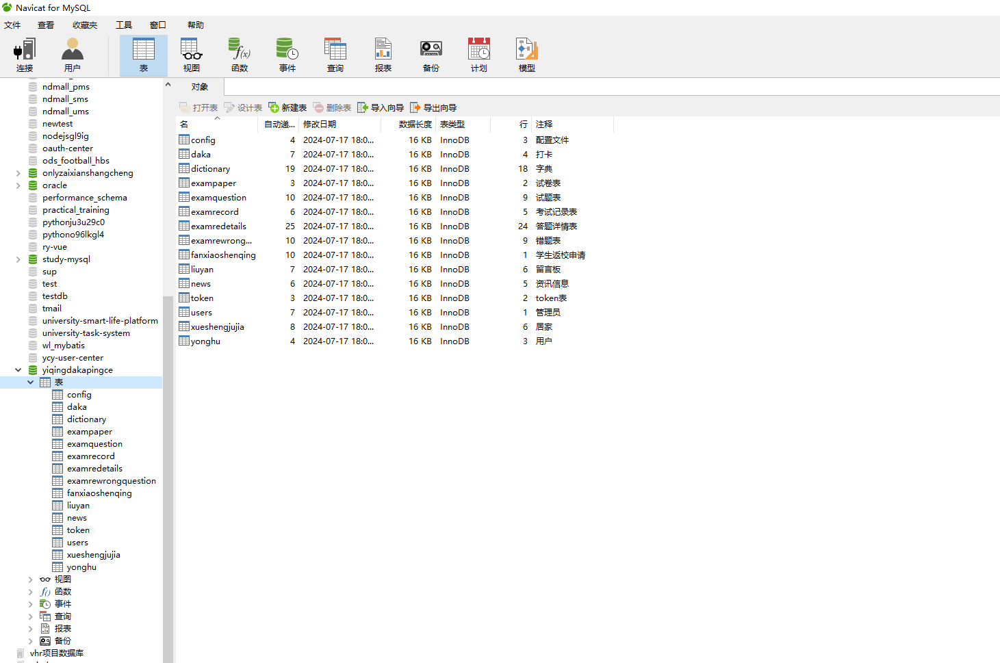

登录

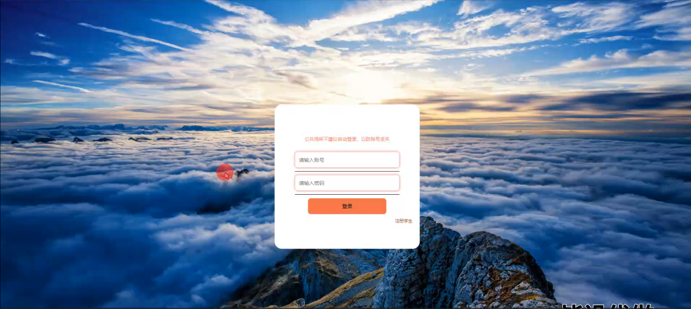

试卷表模块

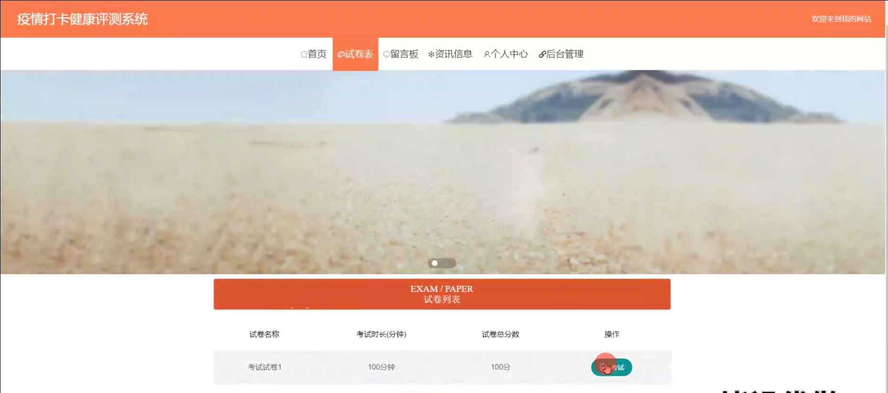

留言板模块

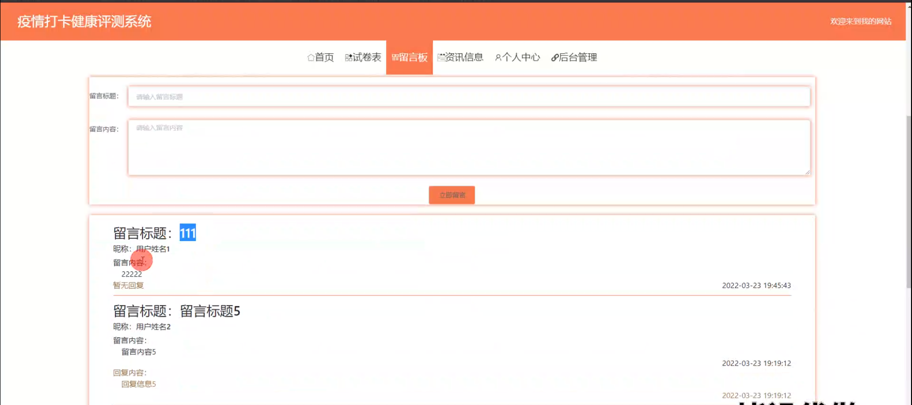

资讯信息模块

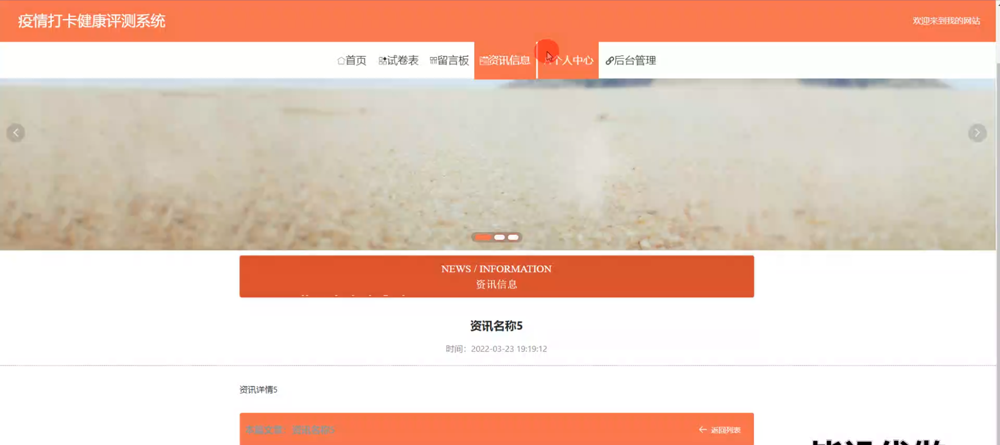

个人中心

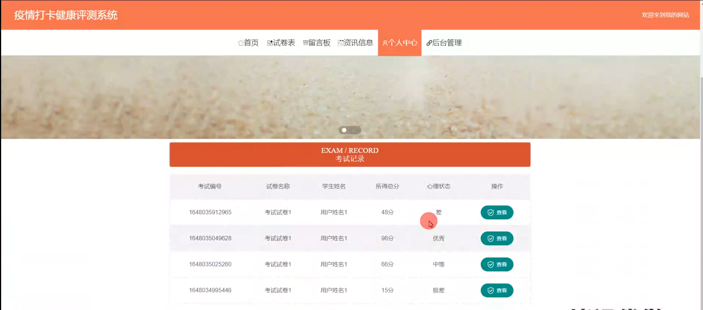

基础数据管理

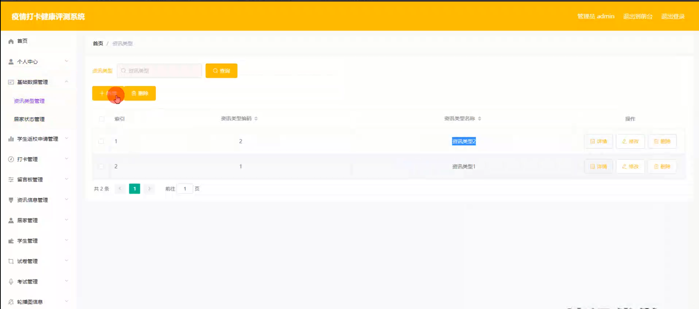

留言板管理

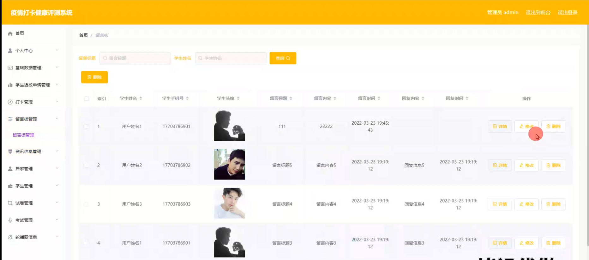

资讯信息管理

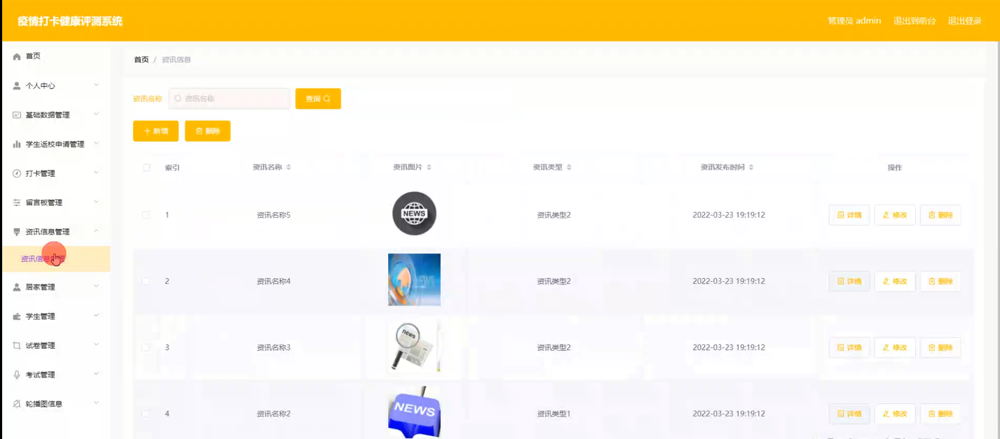

学生管理

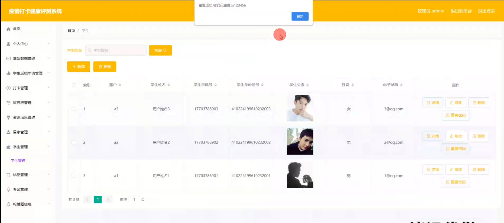

试卷管理

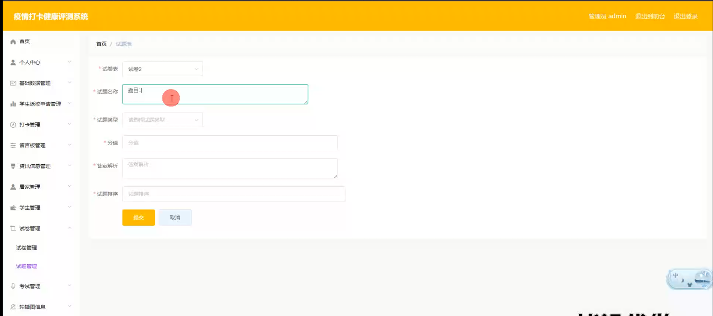

考试管理

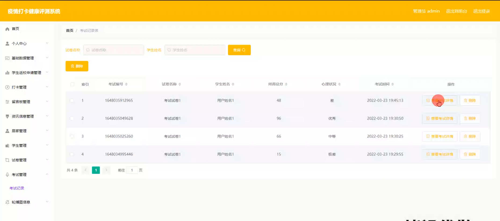

学生端打卡管理

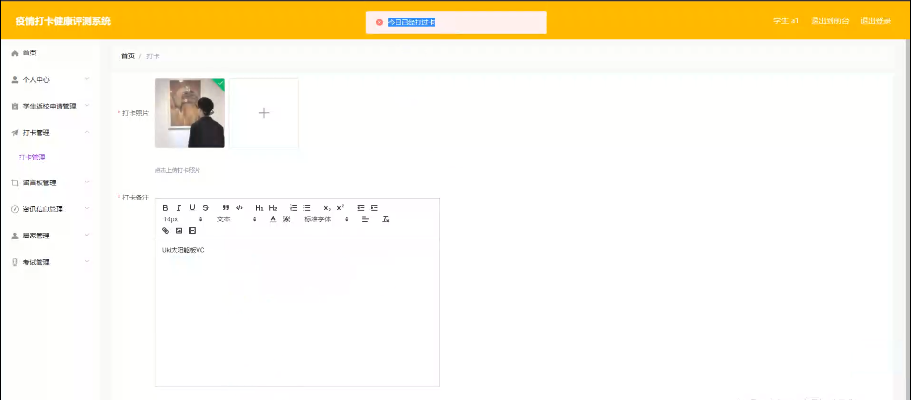

考试记录

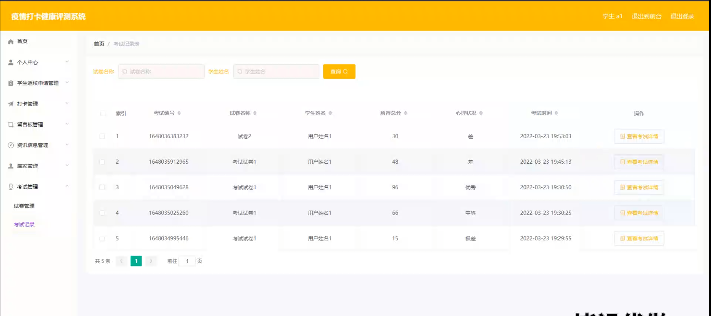

居家管理

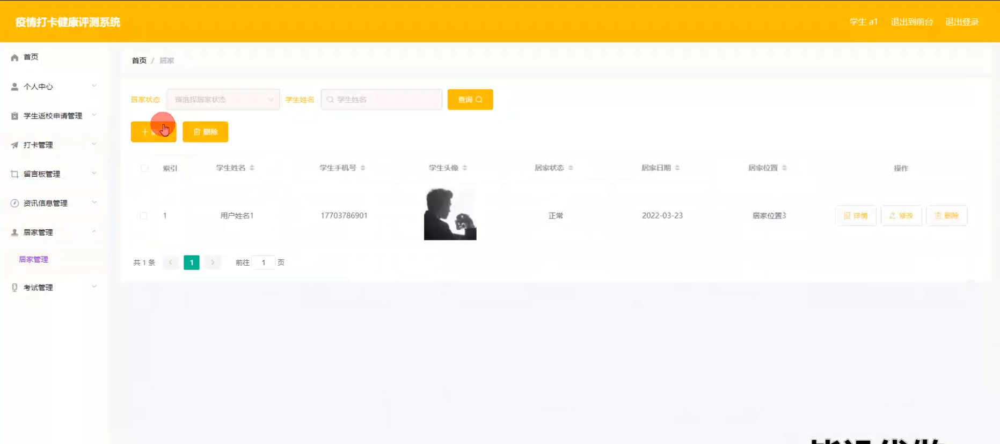

#### 总结

疫情打卡健康评测系统的开发和应用是信息化技术在疫情防控中的重要体现。通过基于Spring Boot的疫情打卡健康评测系统，我们不仅提升了疫情期间的健康管理效率，还为用户提供了更加便捷和智能的生活和学习体验。未来，我们将继续优化和扩展系统功能，提升设备兼容性和数据安全性，满足更多用户的健康管理需求。

#### 使用说明

创建数据库，执行数据库脚本 修改jdbc数据库连接参数 下载安装maven依赖jar 启动idea中的springboot项目

前台登录页面
http://localhost:8080/yiqingdakapingce/front/index.html

后台登录页面
http://localhost:8080/yiqingdakapingce/admin/dist/index.html

管理员				账户:admin 		密码：admin

用户				账户:a1 		密码：123456